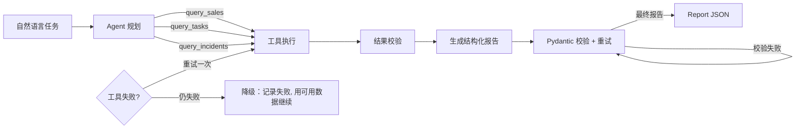

# ReportFlow Agent

> 把一句业务需求变成结构化报告：规划 → 工具调用 → 校验 → 生成，失败自动降级。

ReportFlow 是十天作品集的补充项目，用来证明"不止会做知识库，也能把 LLM 接进
业务流程"。用户输入自然语言任务（如"生成本周销售周报"），Agent 决定调用哪些
工具取数，最后提交一份由 Pydantic 严格校验的结构化报告。项目刻意覆盖 AI 应用
岗位最常被问的三件事：**结构化输出、工具调用、工作流与失败处理**。

## 核心流程



## 接口

| Method | Path | Description |
| --- | --- | --- |
| GET | `/health` | 健康检查 |
| GET | `/tools` | 列出全部可用工具及参数 Schema |
| POST | `/report` | 执行完整流水线，返回结构化报告 |

`POST /report` 请求：

```json
{
  "task": "生成本周销售周报",
  "period": {"start": "2026-08-01", "end": "2026-08-03"},
  "simulate_failure": ["query_sales"]
}
```

`simulate_failure` 用于演示失败处理：指定的工具会被强制失败（含一次重试），
工作流记录失败原因后用剩余数据继续，最终报告标记 `degraded: true`，不会崩溃。

## 工具

| 工具 | 作用 | 失败场景 |
| --- | --- | --- |
| `query_sales(period)` | 查询区间内按区域拆分的销售记录 | 区间倒置 |
| `query_tasks(status?)` | 查询任务列表，可按状态过滤 | 未知状态 |
| `query_incidents(period)` | 查询线上故障记录 | 区间倒置 |
| `compute_totals(records)` | 汇总总金额、订单、客单价、头部区域 | 空记录 |

工具参数带 JSON Schema，结果有输出契约校验（行结构 / 汇总键齐全），契约不满足
即视为失败并重试一次。工具间依赖用 `{"$ref": "query_sales"}` 引用前序输出；
LLM 模式下模型直接传参，两条路径共用同一执行器。

## 两种 Agent

| | RuleAgent（离线） | LLMAgent（真实工具调用） |
| --- | --- | --- |
| 决策方式 | 关键词规则规划 + 模板生成 | 模型自主选择工具并观察结果 |
| 结构化输出 | 直接构造 Pydantic 模型 | 强制调用 `generate_report` 工具，校验失败自动回传重试 |
| 适用 | 演示 / 测试 / CI | 配置好 Key 的生产或面试加分演示 |

两者实现同一 `ReportAgent` 协议，`workflow.run_report` 不感知具体实现；LLM
调用异常时自动降级到 RuleAgent 并标记 `fallback: true`。

## 配置

| 环境变量 | 默认 | 说明 |
| --- | --- | --- |
| `REPORTFLOW_AGENT` | `auto` | `rule` / `llm` / `auto` |
| `OPENAI_API_KEY` | 无 | 设置后 `auto` 模式启用 LLM |
| `OPENAI_BASE_URL` | 无 | OpenAI 兼容 API 地址 |
| `REPORTFLOW_MODEL` | `gpt-4o-mini` | 模型名 |

## 本地运行

```bash
cd reportflow
python3 -m venv .venv
source .venv/bin/activate
pip install -r requirements.txt
./scripts/start.sh        # http://127.0.0.1:8002
```

一键演示（启动 + 跑两个示例请求 + 打开接口文档）：

```bash
./scripts/demo.sh
```

运行测试：

```bash
./scripts/test.sh         # 20 个用例
```

## 与 EvidenceQA 的关系

| | EvidenceQA | ReportFlow |
| --- | --- | --- |
| 回答 | 面向"文档"的 RAG 问答 | 面向"业务动作"的 Agent 报告 |
| 关键能力 | 检索、引用溯源、评测 | 工具调用、结构化输出、失败降级 |
| 面试价值 | 知识库全链路 + 量化指标 | Agent 机制 + 工程化兜底 |

两个项目共用同样的工程习惯：接口与实现分离（Provider/Agent 协议）、离线可演示、
测试隔离环境、量化可验证。

## 面试切入点

- 工具调用循环怎么设计？为什么 Agent 与 Workflow 分离？
- 结构化输出如何保证？Pydantic 校验失败时如何让模型重试？
- 工具失败、依赖缺失、生成异常分别怎么处理？为什么降级而不是崩溃？
- LLM 与规则实现共用接口，测试为什么可以不依赖网络？
